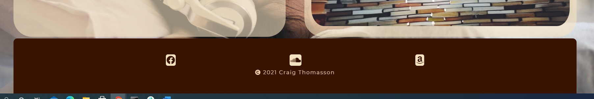

# Craig Thomasson Audiobook Narration 
Click [here](https://craigthomasson.github.io/project-one-repo/) to view the live web site 

### responsive design 

## UX

## Strategy
 

## Goals
The goal was to create a site that will increase the online presence of the audiobook narrator, and increase the amount of potential work they are offered. The site needs to clearly state what service is offered, with a clear example of the quality of the product. 
At the same time, it should make it quick and easy to contact the narrator and request work.

##### To achieve these goals I will need to:
* Create a website with good searchability
* Have playable examples of work that is easy to access
* Ensure the contacts section is clear and easy to find
* Create a UX design that is intuitive to use and flows well
* The users will:
    * Be looking to hire an audiobook narrator
    * Be able to quickly navigate the site to sample work and the contact section
    * Have a clear understanding of the services offered

## Wireframes for Original Concept

### First Draft of Home Page

### First Draft of Pricing Page

### First Draft of Contact Page

## Updated Wireframe

### One Page Layout

 

## Functionality

## Load Screen/About Section

The user can see what services are offered by the narrator in the About section, and can see clear navigation options to the Samples section and the Contact section. There is also a call to action at the end of the About section, so the user can be directed to the Contact page. This will make it easier for first time users to navigate the page. The call to action will also help returning users who may be comparing narrators, to quickly navigate to the Contact page.
* The title and subtitle make it clear that the site is for audio book narration and the About section clearly states the services offered
* There is a Nav bar that will send the user to each section of the page
* I decided to turn this site in to a one-page site part way through the project as this will mean that everything the user needs is easy to access
* I used a call to action that links to the Contact section so that the user can quickly navigate to that section of the site

## Sample Section

The Samples in this section are easy for the user to find and offer brief descriptions to give the user some context.
 * This section contains two audio players with samples of the narrator's work 
 * The Samples section is the reason I chose to change to a one page style website, as it made more sense to have the samples easily accessible to the user
* The audio players do not autoplay when the site loads and can be controlled by the user 
* This section also contains an image of the audio equipment a narrator would use

## Contact Section 

Here the user can submit a request for their audio to be recorded. The form is clearly labelled and allows the user to leave all relevant information about their book.

* This section contains a form and basic description about hiring the narrator.
* There is also an image that fits the themes of the site.
* The form consists of: 
    * Text inputs for names
    * Email inputs
    * Number inputs
    * Inputs to upload docs
    * Text area inputs for more details
    * A submit button
* All inputs from the form have the required attribute

## Footer

* The Footer is styled to match the header and to close off the page in an aesthetically pleasing way.
* It contains links to socials and also copyright info.

* I used a call to action that links to the ontact section so that user that want to hire the narrator can quickly navigated to that section of the sight

## Validation

* CSS was ran through (Jigsaw) validator and has no errors
* HTML was ran through W3C validator with no issues

## Technologies used
HTML, CSS. Reaper DAW to create sample audio.

### Sources and References
* Images souced from unsplash.com and www.pexels.com
* I used this site as a reference for using CSS grids: https://learncssgrid.com/
* I based my audio code on code examples from this page: https://developer.mozilla.org/en-US/docs/Web/HTML/Element/audio

