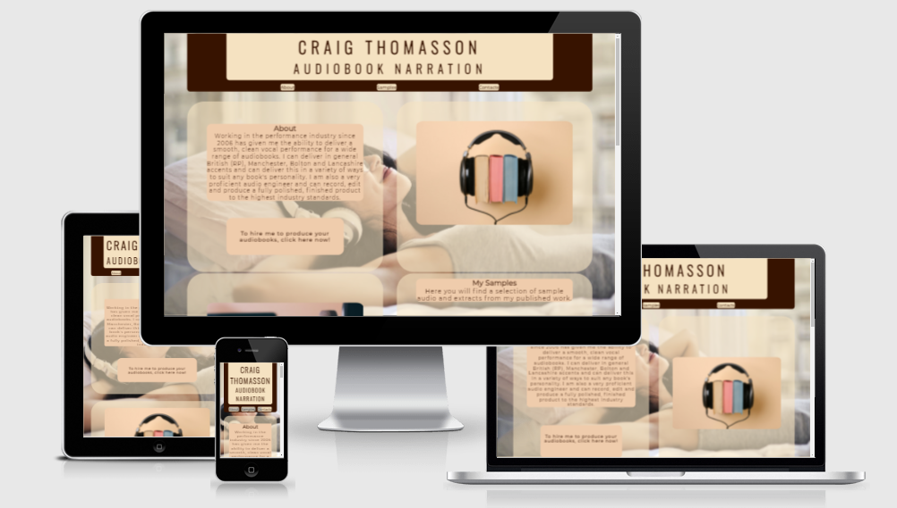
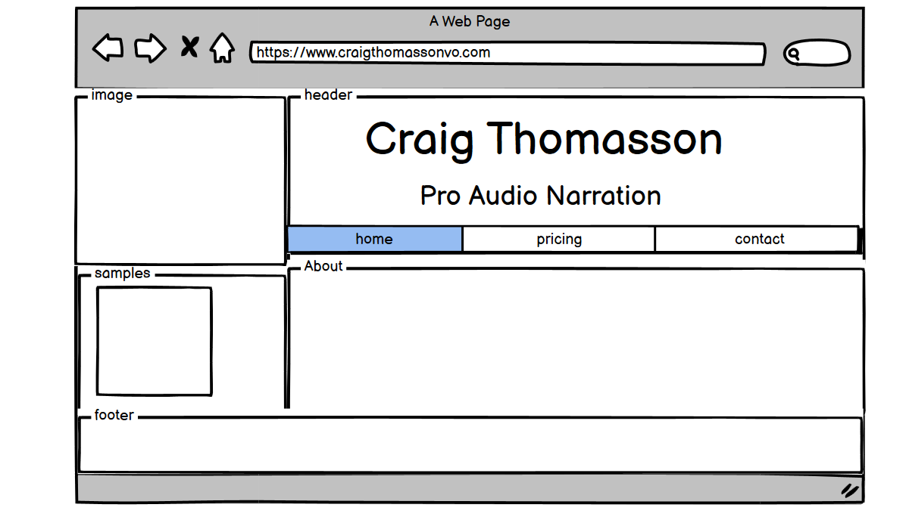
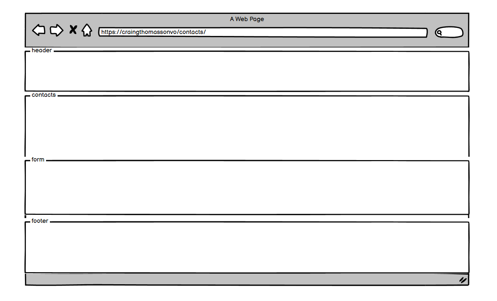
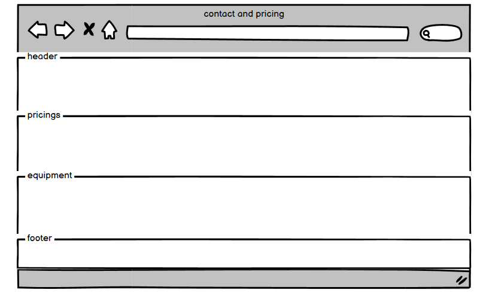
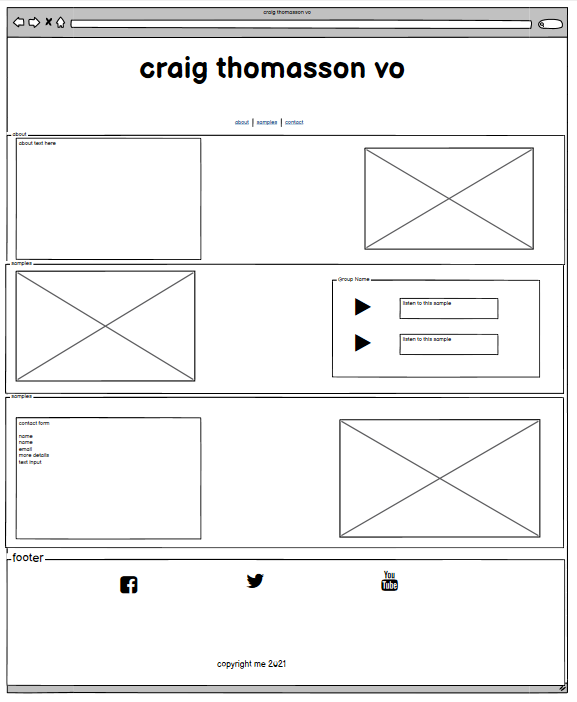
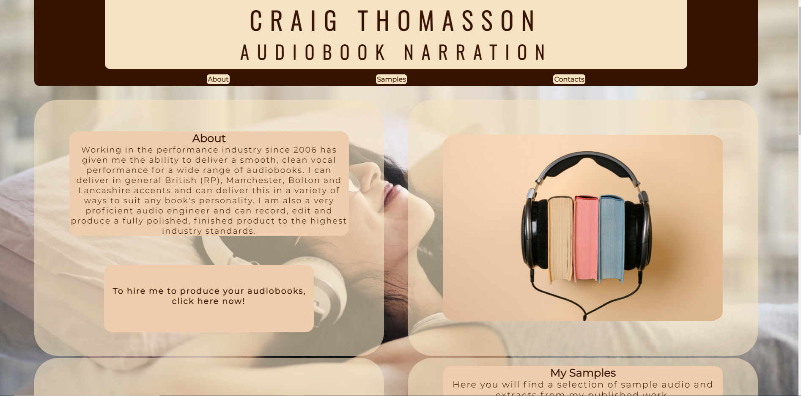
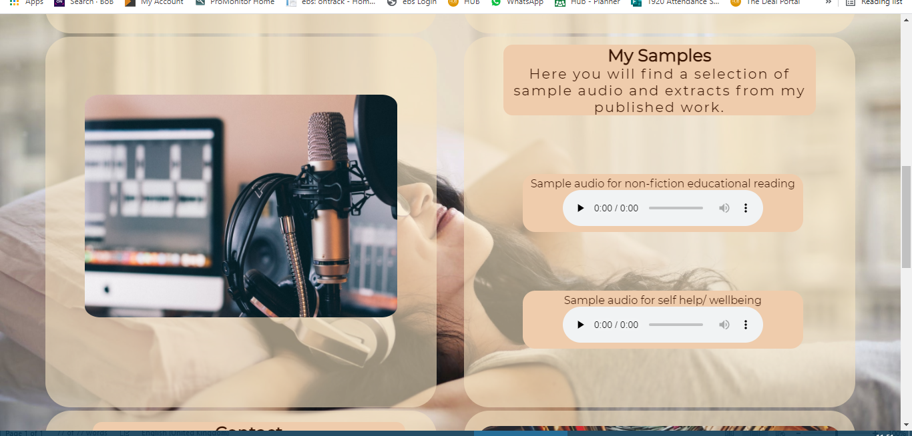

# Craig Thomasson Audiobook Narration 
Click [here](https://craigthomasson.github.io/project-one-repo/) to view the live web site 

### responsive design 

## UX

## Strategy
 

## Goals
The goal was to create site that will increase the online presence of the audiobook narrator and increase the amount of potential work they are offered. The site needs to clearly state what service is offered with clear example of the quality of the product. 
At the same time, it should make it quick and easy to contact the narrator and request work.

##### To achieve these goal’s I will need to:
* Create a web site with good searchability 
* Have playable examples of work that is easy to access
* Ensure the contacts section is clear and easy to find.
* Create a UX design that is intuitive to use and flows well.
The users will:
* Be looking to hire an audiobook narrator:
* Be able to quickly navigate to sample work and the contact section
* Have a clear understanding of the services offered. 

## wire frames for original concept

### first draft of home page

### first draft of pricing page

### first draft of contact page

## updated wire frame

### One page layout

 

## Functionality:

## Load screen/about section

The site opens to a title, subtitle and about section. 
* The title and subtitle make it clear that the site is for audio book narration and the about section clearly stats the services offered.
* There is a nave bar that will send the user to each section of the page.
* I decided to turn this site in to a one-page site part way through he projects as this will mean that every thing the user need is easy to access. 
* I used a call to action that link to the contact section so that user that want to hire the narrator can quickly navigated to that section of the sight

## sample section

 * This section contains two audio players with samples of the narrators work. 
 * The samples section is the reason I chose to change to a one page style website as it made more sense to have the samples easily accessible to the user. 
* The audio players do not auto play when the site loads and can be controlled by the user. 
* This section also contains and image of the audio equipment a narrator would use. 

